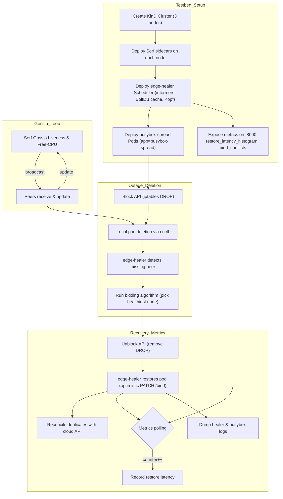

# Edge-Healer

A lightweight self-healing DaemonSet agent for Kubernetes edge clusters.  
Whenever the control-plane (API server) becomes unavailable, the agent gossips liveness & free-capacity among peers, caches desired ReplicaSet specs locally, and optimistically re-binds missing Pods on the healthiest survivor node. When the WAN link returns, it reconciles duplicates to prevent split-brain.

---

## Features

- **Serf-based gossip** (via python-serfclient) for peer health and free-CPU exchanges  
- **Kopf operator** (async) to watch Pods & ReplicaSets  
- **Optimistic patch /binding** to restore deleted Pods in ≤ 0.3 s  
- **SQLite cache** of desired ReplicaSet state for cold-boot offline recovery  
- **Prometheus metrics** (restore latency histogram, bind conflicts, gossip updates)  

---

## Architecture



## Repository Layout

```

.
├── cache.py                  # SQLite-based DesiredStateCache
├── gossip.py                 # SerfGossip wrapper
├── main.py                   # Kopf operator entrypoint
├── metrics.py                # Prometheus metrics & HTTP server
├── scheduler.py              # bid\_and\_bind logic
├── requirements.txt
├── Dockerfile                # container build for edge-healer
├── config
│   ├── daemonset.yaml        # DaemonSet + Serf sidecar
│   └── service-metrics.yaml  # (optional) NodePort Service for metrics
├── dev
│   └── busybox-spread.yaml   # test workload with one replica/node
└── README.md

````

---

## Prerequisites

- Kubernetes cluster (e.g. [KinD][kind] named `serf-demo`)  
- `docker`, `kubectl`, `kind` CLIs installed  
- Python 3.11+ (for local development)  

[kind]: https://kind.sigs.k8s.io/

- demo: legacy iptables
    ```bash
    sudo update-alternatives --set iptables   /usr/sbin/iptables-legacy
    sudo update-alternatives --set ip6tables  /usr/sbin/ip6tables-legacy
    ```

---

## Build & Load Image

```bash
# From repo root
docker build -t edge-healer:0.1 .

# For KinD cluster "serf-demo"
kind load docker-image edge-healer:0.1 --name serf-demo
````

---

## Deploy the DaemonSet

1. **Ensure Serf sidecar** is in your DaemonSet (it uses HostNetwork) -- saved within `config/daemonset.yaml`
2. **Apply** the YAML:

   ```bash
   kubectl apply -f config/daemonset.yaml
   kubectl -n kube-system rollout status ds/edge-healer
   ```

---

## Verify & Test Healing

1. **Deploy test workload** (one Pod per node):

   ```bash
   kubectl apply -f dev/busybox-spread.yaml
   ```

2. **Force-delete** a Pod:

   ```bash
   POD=$(kubectl get pod -l app=busybox-spread -o name | head -1)
   kubectl delete "$POD" --grace-period=0 --force
   ```

3. **Watch healer logs** for the bind decision:

   ```bash
   kubectl -n kube-system logs ds/edge-healer -c healer --since=5s | grep "won bid"
   ```

4. **Confirm** replacement Pod appears in < 0.3 s.

---

## Metrics & Monitoring

By default the agent exposes Prometheus metrics on port **8000** of each node (via `hostNetwork: true`). Key metrics:

* `restore_latency_seconds`
* `bind_conflicts_total`
* `peer_updates_total`

### Direct curl

```bash
NODE_IP=$(kubectl get node -o wide | awk 'NR==2{print $6}')
curl -s http://$NODE_IP:8000/metrics \
  | grep -E 'restore_latency|peer_updates'
```

### (Optional) NodePort Service

```bash
kubectl apply -f config/service-metrics.yaml
curl -s http://<NODE_IP>:30080/metrics \
  | grep -E 'restore_latency|peer_updates'
```

---

## Running Tests

Unit and integration tests are provided in the `src/tests/` directory. To run the tests locally:

1. **Create and activate a virtual environment** (if not already):

   ```bash
   python3 -m venv .venv
   source .venv/bin/activate
   ```

2. **Install the package in development mode with test dependencies:**

   ```bash
   pip install -e ".[test]"
   ```

3. **Run all tests** (from the project root directory):

   ```bash
   # Make sure you're in the project root directory (where setup.py is located)
   pytest src/tests/
   ```

4. **Run with coverage:**

   ```bash
   pytest --cov=src src/tests/
   ```

5. **Run specific test categories:**

   ```bash
   pytest src/tests/unit/         # Run only unit tests
   pytest src/tests/integration/  # Run only integration tests
   ```

Tests use `pytest`, `pytest-asyncio`, and `pytest-mock` for mocking and async support. Fixtures and mocks are provided in `src/tests/conftest.py`.

---

## Advanced Topics

* **Peer-TTL pruning**: drop Serf peers idle > 2 s
* **Cold-boot replay**: restore missing Pods on startup if offline
* **Split-brain reconciliation**: delete duplicates when control-plane returns
* **uvloop integration**: add `uvloop.install()` in `main.py` for lower latency
* **Unit tests**: use `pytest-asyncio` and mocks for bidding logic
* **Packaging**: Helm chart or Kustomize overlay

